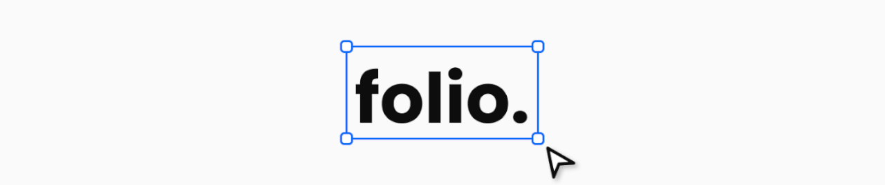

> A minimalistic and infinite whiteboard. Sketch, Prototype, and Design with total freedom.

[Website](https://folio.josemi.xyz) · [Try it](https://folio.josemi.xyz/app) · [Documentation](https://folio.josemi.xyz/docs) · [Changelog](https://github.com/jmjuanes/folio/CHANGELOG.md) · [Report a bug](https://github.com/jmjuanes/folio/issues)


## Note: Folio is still a Work in Progress

We are excited to share our drawing application with you, but please be aware that it is currently in active development. While the app is fully functional and offers a range of features, we are continuously working to enhance and expand its capabilities.

You might encounter occasional bugs or experience features that are still being refined. We appreciate your patience and understanding as we work to deliver the best possible drawing experience.

We encourage you to share your thoughts, suggestions, and any issues you encounter.

## About this Repository

This repository contains the core source code for [Folio](https://folio.josemi.xyz), a modular whiteboard built with React and TypeScript (mostly), designed for structured sketching and local-first workflows. It also includes the full codebase for [Folio Studio](https://folio.josemi.xyz/studio) - a full-stack and self-hosted application combining a Node.js backend (GraphQL + SQLite) with the frontend editor — as well as the [landing page](https://folio.josemi.xyz) and [documentation](https://folio.josemi.xyz/docs) for the project.

## Repository Structure

Folio is organized as a monorepo with modular packages grouped by purpose:

### Core Packages

Shared building blocks used across Folio's applications.

- `folio-react`: core Folio whiteboard built with React.
- `folio-client`: Vanilla JS port of `folio-react` (not yet available).

### Applications Packages

Standalone apps built on top of Folio's core.

- `apps/studio`: frontend for Folio Studio (editor + UI).
- `apps/lite`: codebase for Folio Lite (browser-only version).
- `server`: backend for Folio Studio (Node.js + GraphQL + SQLite).

### Website Packages

Public-facing sites for Folio's landing page and documentation.

- `website/landing`: landing page for Folio.
- `website/docs`: documentation site for Folio.

## Development

### Prerequisites

Make sure you have the following software installed on your computer: 

- [Node.js](https://nodejs.org) - preferably the latest version, or at least version 20.
- [Yarn](https://classic.yarnpkg.com/lang/en/) - recommended package manager for consistency across environments.
- [Git](https://git-scm.com) - to clone the repository.
- [Docker](https://www.docker.com/get-started) (optional) - to build and run the Folio Studio server image.

### Clone and Install Dependencies

Clone the repository in your local machine:

```bash
$ git clone https://github.com/jmjuanes/folio
```

Navigate into the cloned repository and install all dependencies:

```bash
$ yarn install
```

### Commands

#### Development Commands  

Used during active development to run Folio in watch mode, preview changes, or serve local builds.

- `yarn dev:lite`: start Folio Lite in development mode.
- `yarn dev:studio`: start Folio Studio in development mode. It uses a mock backend to simulate server interactions.

#### Build Commands  

Compile Folio's components for production.

- `yarn build:lite`: build Folio Lite (browser version).
- `yarn build:studio`: build Folio Studio (frontend).
- `yarn build:server`: build the backend (GraphQL + SQLite).

#### Website Commands  

Build and serve the public-facing parts of Folio: Lite, landing page, and documentation.

- `yarn build:website`: build all website assets (Lite + landing + docs).
- `yarn build:landing`: build the landing page.
- `yarn build:docs`: build the documentation site.
- `yarn copy:website`: copy all website builds to `www/` folder.

#### Other Commands  

Utility scripts for Docker, asset management, cleanup, and type checking.

- `yarn docker:studio`: build Docker image for Folio Studio.
- `yarn clean`: remove build output (`www/`).
- `yarn copy-assets`: copy static assets.
- `yarn test`: run tests with Jest.
- `yarn typecheck`: type check Folio Server.
- `yarn typecheck:lite`: type check Folio Lite.
- `yarn typecheck:studio`: type check Folio Studio.

### Building Folio Studio

To run Folio Studio locally, you will need to build both the frontend and backend, set up the environment, and start the server.

First, you will need to compile the frontend of Folio Studio by executing the following command:

```sh
$ yarn build:studio
```

This will generate the static assets of Folio Studio inside `apps/studio/www`. Then, you have to transpile the TypeScript server into runnable JavaScript:

```sh
$ yarn build:server
```

After that, create a `.env` file to define runtime configuration for the server. At minimum, include:

```env
FOLIO_PORT=8080
FOLIO_WEBSITE_PATH=apps/studio/www
``` 

Finally, execute the following command to launche the backend and serves the frontend from the path defined in `FOLIO_WEBSITE_PATH`:

```sh
$ yarn start
```

Once running, Folio Studio will be available at `http://localhost:8080` or in the port defined in the `FOLIO_PORT` variable.

#### Environment variables

Folio Studio supports environment variables for configuration. You can define them in a `.env` file at the root of the project. Common options include:

- `FOLIO_PORT` - Port where the server will run (default: `8080`).
- `FOLIO_WEBSITE_PATH` - Path to static assets served by the backend.
- `FOLIO_STORAGE_FILE` - Path to the local SQLite database file.
- `FOLIO_TOKEN_SECRET` - JWT secret key (optional; auto-generated if not set).
- `FOLIO_TOKEN_EXPIRATION` - Token lifetime (e.g. `7d`, parsed by [ms](https://www.npmjs.com/package/ms)).
- `FOLIO_ACCESS_TOKEN` - Fixed access token (optional; insecure, use only for testing).

## Contributing

Pull requests are welcome. If you are planning to add a new feature or make a significant change, please open a [discussion or issue](https://github.com/jmjuanes/folio/issues) first - it helps keep the project aligned and avoids duplicated work.

Before submitting a PR:

- Make sure your code follows the existing style and structure.
- Prefer TypeScript and modular design when possible.
- Keep UI changes minimal unless they improve clarity or usability.
- If your change affects multiple packages (Lite, Studio, Docs), mention it clearly.

Bug fixes, documentation improvements, and small enhancements are always appreciated.

## License

Code is released under the [MIT](./LICENSE) license.
